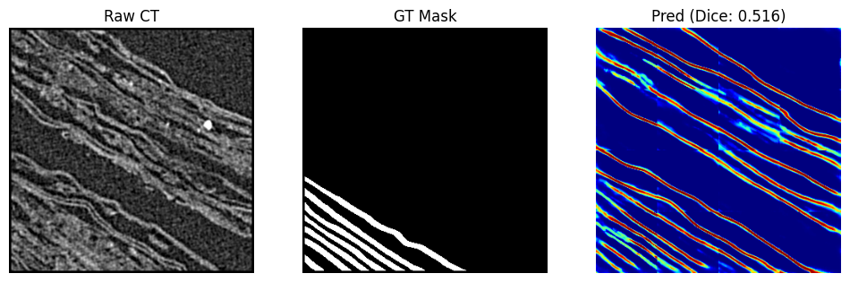
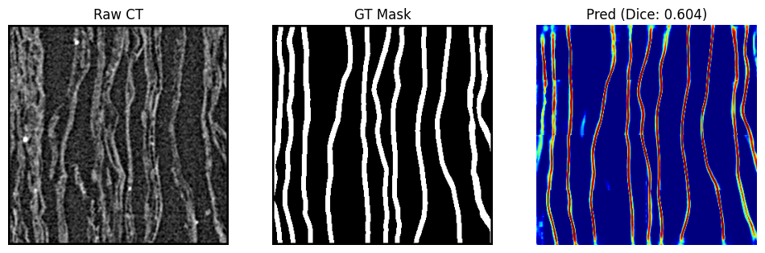

# Vesuvius Challenge - Surface Detection: VNet-Mamba

## About
This project implements a **Mamba-Enhanced VNet-FPN** architecture designed for the Vesuvius Challenge - Surface Detection. The goal is to virtually unwrap ancient carbonized scrolls from the Villa dei Papiri by accurately segmenting the papyrus sheets within 3D X-ray CT scans.

Traditional 3D segmentation models often struggle with the complex, anisotropic nature of scroll data, leading to topological errors like "wormholes" (spurious connections between layers) or "tears" (holes in the sheet). This project integrates **Bidirectional Mamba State Space Models (SSM)** into a VNet architecture to explicitly model the sequential nature of the Z-axis (depth), allowing the network to track sheet-gap-sheet transitions more effectively than standard convolution or attention mechanisms.

## Features
- **Mamba Z-Axis State Tracking:** Utilizes Bidirectional Mamba SSM blocks at deep encoder stages and the bottleneck to track sheet/gap states through depth with linear $O(D)$ complexity.
- **Factored Anisotropic Convolutions:** Replaces standard 3D convolutions with factored $(1,3,3)$ and $(3,1,1)$ kernels to separate XY-plane texture analysis from Z-axis layer transitions.
- **Topology Refinement Head:** A specialized output head using multi-scale dilated convolutions to perform learnable morphological cleanup, significantly reducing topological noise.
- **Boundary Detection:** Auxiliary head trained to detect surface boundaries, sharpening the final volumetric mask.
- **Memory Efficient:** Optimized architecture removing expensive $O(D^2)$ attention mechanisms, allowing for larger batch sizes on standard GPUs.

## Requirements
To run this project, you will need the following dependencies:

* **Operating System:** Linux (Ubuntu 20.04+ recommended) or Windows w/ WSL2
* **Python:** 3.10 or later
* **Deep Learning Framework:** PyTorch (with CUDA support)
* **Key Libraries:**
    * `mamba_ssm` (State Space Model implementation)
    * `causal_conv1d`
    * `numpy`, `pandas`, `scipy`
    * `tifffile` (for handling .tif volumes)
    * `imagecodecs`

## System Architecture
The model follows a VNet-FPN (Feature Pyramid Network) design enhanced with Mamba blocks:

1.  **Physics Adapter:** Pre-processes input volumes using explicit gradient and Laplacian computations.
2.  **Encoder:** A 3-stage downsampling path. Stages 2 and 3 incorporate **Mamba Z-Blocks** to capture long-range depth dependencies.
3.  **Bottleneck:** Combines ASPP (Atrous Spatial Pyramid Pooling) with Mamba for global context.
4.  **Decoder:** An FPN-style upsampling path with skip connections to merge semantic and spatial features.
5.  **Heads:** Multiple output heads for Mask, Skeleton, Centerline, Vectors, and Boundary detection.

## Output
The system outputs a 3D binary mask (`.tif` format) representing the segmented papyrus sheet.

#### Visualization
Below are examples of the model's performance on validation slices:

**Input Raw CT vs. Ground Truth vs. Prediction**
*(Note: Images from your results directory)*

*Figure 1: Comparison of Raw CT, Ground Truth, and VNet-Mamba Prediction (Dice: 0.516)*

*Figure 2: Handling complex folded regions (Dice: 0.604)*

## Results and Impact
This model contributes to the global effort to read the Herculaneum scrolls. By improving surface detection accuracy—specifically by reducing topological errors—this tool aids in the "virtual unwrapping" pipeline. Better segmentation allows for cleaner flattening of the scrolls, which is the prerequisite for detecting ink and reading the ancient text hidden inside.

## References
1.  **Vesuvius Challenge:** [https://scrollprize.org](https://scrollprize.org)
2.  **Mamba:** Gu, A., & Dao, T. (2023). Mamba: Linear-Time Sequence Modeling with Selective State Spaces.
3.  **V-Net:** Milletari, F., et al. (2016). V-Net: Fully Convolutional Neural Networks for Volumetric Medical Image Segmentation.
4.  **clDice:** Shit, S., et al. (2021). clDice - a Novel Topology-Preserving Loss Function for Tubular Structure Segmentation.
